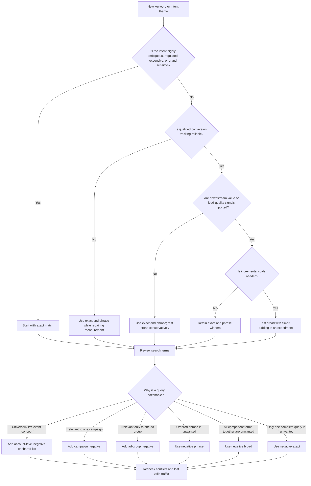
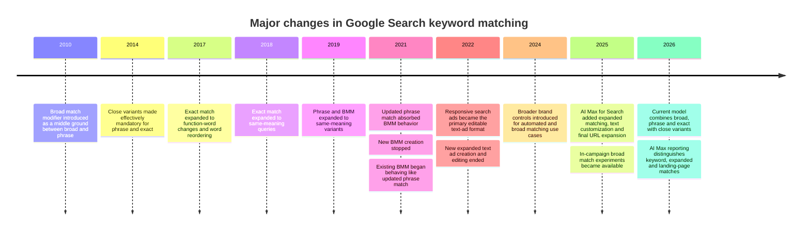

<!--
REFERENCE: Generic 2026 Google Search Ads field, settings, and audit framework.
Vendor-neutral. Use this as the authoritative catalog of every editable object a
Search campaign can contain, plus the audit logic for what to configure and why.
The "Master editable-field inventory" and "Audit checklist" tables are the parts
to lean on when building or reviewing a campaign. Platform specifics drift over
time; treat dated figures (budget multipliers, character limits) as current-as-of
mid-2026 and re-verify anything that looks stale.
-->

# Google Search Ads Editable Fields, Settings, Inputs, and Audit Framework

## Executive summary

As of **August 3, 2026**, a Google Search campaign is no longer simply a collection of keywords and text ads. It is a layered decision system in which account-level measurement, campaign goals and budgets, bidding, keyword or dynamic targeting, audience and location signals, ad assets, landing-page controls, and automated expansion features jointly determine whether an ad enters an auction, which query it can match, which landing page is selected, what creative is assembled, and how much is bid.

The most important audit conclusions are:

- **Measurement is upstream of nearly every automated decision.** Maximize Conversions, target CPA, Maximize Conversion Value, target ROAS, broad match, audience signals, and AI Max perform against the conversion actions and values supplied to Google. Incorrect primary actions, duplicated tags, low-quality lead events, or missing offline outcomes can cause the system to optimize efficiently toward the wrong business result. Google now recommends enhanced conversions for leads for upgraded offline measurement, using hashed first-party data together with click identifiers; since June 15, 2026, new upload workflows have been moving toward Google Ads Data Manager rather than legacy Google Ads API uploads.
- **Keyword match types are intent bands, not literal string rules.** Exact match can match searches with the same meaning or intent; phrase match can match searches containing the keyword’s meaning; broad match can match related searches even when the keyword’s direct wording is absent. Close variants apply to all positive match types and cannot be disabled.
- **Broad match is not a universally superior default.** Google explicitly ties broad match to Smart Bidding and additional contextual signals. Recent vendor datasets show broad match attracting more spend, but exact match often retaining stronger efficiency, particularly in lead-generation accounts. These studies are observational rather than controlled causal evidence, so broad expansion should normally be tested against a stable control.
- **The principal current Search ad is the responsive search ad.** An RSA accepts up to 15 headlines of 30 characters, four descriptions of 90 characters, two 15-character display paths, a final URL, optional mobile URL, URL tracking controls, and optional pins. Google can combine or reposition eligible assets and can use unused RSA text in additional link-like placements.
- **Expanded text ads are legacy objects.** New ETAs can no longer be created or edited, although existing approved ETAs may continue to serve. Dynamic Search Ads remain available for website-content-based targeting, dynamically generated headlines, and dynamically chosen landing pages.
- **AI Max adds a second targeting and creative layer above conventional keywords.** Depending on enabled components, it can expand search-term matching, generate customized text, and select alternate relevant landing pages. Brand inclusions or exclusions, URL inclusions or exclusions, locations of interest, text guidelines, and reporting source fields therefore belong in a current Search audit.
- **The highest-impact configuration errors are usually not minor copy defects.** They are bad conversion definitions, unintended location options, accidental Search-partner exposure, inappropriate bidding targets, uncontrolled query or URL expansion, missing negatives, inadequate budgets, policy or destination failures, and assets that send users to irrelevant pages.

This report catalogs the stable, generally available Search configuration schema. Individual accounts may expose additional or fewer controls because of country, language, billing arrangement, regulated-industry status, advertiser verification, conversion eligibility, campaign objective, API version, beta enrollment, or account history.

## Scope, hierarchy, and current ad formats

This audit covers **Google Search campaigns and Search ads only**. It excludes Display, Video, Demand Gen, Shopping, App campaigns, and Performance Max except where an account-wide item—such as a conversion action, audience, shared budget, automated asset, or negative list—also directly affects a Search campaign.

Google Ads configuration follows a hierarchy. More specific objects usually govern serving for their scope, but precedence is not uniform:

1. **Account and shared-library objects** contain conversion actions, audiences, lists, shared budgets, portfolio bid strategies, business data, scripts, rules, account-level automated assets, and account-level URL or negative controls.
2. **Campaign settings** establish budget, bidding, networks, geography, language, goals, schedules, devices, broad automation, and campaign-wide assets.
3. **Ad groups** organize a closely related intent, audience, keyword, dynamic target, bid, and ad set.
4. **Keywords and dynamic targets** establish query or page eligibility.
5. **Ads and associated assets** establish the message, destination, business identity, and additional actions.
6. **Tracking and conversion objects** feed post-click outcomes back into reporting and bidding.

A more specific asset does not always suppress a broader asset. For example, higher-level sitelinks can be eligible alongside campaign-level sitelinks when Google predicts that the combination will improve performance, while a structured snippet at the ad-group level normally prevents campaign- and account-level structured snippets from serving for that ad group.

| Search ad format | Current role | Editable inputs | Automation and dependencies | Audit position |
|---|---|---|---|---|
| **Responsive search ad** | Primary editable text-ad format | Final URL, optional mobile URL, 1–15 headlines, 1–4 descriptions, two optional display paths, pins, tracking template, suffix, custom parameters | Google selects combinations and may reposition or reuse eligible assets; campaign-level text assets and AI-generated text may add further combinations | Required baseline for conventional Search ad groups; test propositions, not trivial punctuation changes |
| **Expanded text ad** | Legacy text-ad object | Historically three 30-character headlines, two 90-character descriptions, two 15-character paths and URL fields | New creation and editing ended; existing ads may continue serving | Preserve only when demonstrably incremental; do not build future architecture around ETAs |
| **Dynamic Search Ad** | Website-content-based Search format | Ad-group type; dynamic targets or page feed; exclusions; description lines; tracking controls | Google generates headline and usually selects the final landing page from the indexed site or page feed | Useful for inventory coverage, long-tail discovery, and site expansion; requires excellent site taxonomy and URL exclusions |
| **Call-focused Search configuration** | RSA plus call asset is the current preferred structure | RSA inputs plus phone number, call reporting, conversion setting and schedule | Phone number verification and call-asset eligibility apply | Use for call-led lead generation; audit business hours and call-quality conversion logic |
| **Legacy call ad** | Older call-first Search object where still present | Business name, number, optional headlines, descriptions, paths, verification URL and final URL | Availability and creation have been restricted as Google transitions advertisers toward RSAs with call assets | Migrate to RSA plus call assets unless a documented exception justifies retention |

RSA limits are 30 characters for each headline, 90 for each description, and 15 for each path; up to three headlines may appear in the conventional headline position. Campaign-level RSA text assets can add up to three further headlines and two descriptions across the campaign, outside the ad-level 15-and-four allocation.

Dynamic Search Ads use the content and organization of a website to identify relevant searches and fill coverage gaps. Advertisers can target categories, exact URLs, page rules, page-feed labels, or all pages, and can exclude URLs or categories that should not advertise.

## Master editable-field inventory

The following table is the consolidated Search audit inventory. “Limits” describes major practical or documented constraints rather than every API validation rule.

| Field name | Location (level) | Definition | Limits | Best practice | Example |
|---|---|---|---|---|---|
| Account name | Account | Administrative account label | Text; no serving effect | Use a stable legal entity, brand, country and currency naming convention | `Acme US – Search` |
| Time zone | Account creation | Time basis for reporting, schedules and budget cycles | Normally cannot be changed after account creation | Verify before launch; document daylight-saving implications | `America/Chicago` |
| Currency | Account creation | Currency for budgets, bids, costs and conversion values | Normally immutable after account creation | Match finance reporting and transaction currency | `USD` |
| Auto-tagging | Account | Adds Google click identifiers to landing-page URLs | Requires destinations and redirects to preserve parameters | Keep enabled unless a documented analytics architecture requires otherwise | `gclid=...` |
| Account tracking template | Account | Highest-level click-tracking template | Must resolve to the same final destination domain rules; lower levels override it | Centralize third-party tracking here when uniform | `{lpurl}?source=google` |
| Account final URL suffix | Account | Parameters appended to final URLs | Enter parameters, not a second destination URL | Use for analytics parameters that do not require redirects | `utm_source=google&utm_medium=cpc` |
| Conversion action name and category | Account / Goals | Defines the measured business event | Categories include purchase, lead, call, store action and others; availability varies | Use one clear action per materially distinct outcome | `Qualified consultation` |
| Primary or secondary action | Account / Campaign goals | Determines whether an action appears in the “Conversions” column and is used for bidding | Primary actions can influence Smart Bidding; secondary actions normally remain observational | Mark only true optimization outcomes primary | Primary: `Closed sale`; secondary: `Pricing page view` |
| Conversion value | Conversion action / import | Monetary or relative value assigned to a conversion | Static, dynamic or imported; currency and data-quality rules apply | Pass actual revenue, margin or qualified-lead value where possible | `$8,400 contract value` |
| Count setting | Conversion action | Controls one conversion per click or every conversion | “Every” usually fits purchases; “One” often fits leads | Match the economic event, not the easiest reporting result | One lead per ad click |
| Conversion windows | Conversion action | Click-through and other eligible attribution windows | Available ranges depend on action type | Set from observed sales-cycle latency | 60-day click window |
| Attribution model | Conversion action | Allocates credit among eligible ad interactions | Availability depends on conversion type and account | Use data-driven attribution unless a defensible business reason requires otherwise | Data-driven |
| Enhanced conversions for leads | Account / Data Manager | Matches hashed first-party lead data to ad interactions and imports downstream outcomes | Requires compliant customer data, consent, stable identifiers and CRM timestamps | Use qualified, opportunity and sale stages—not only form submissions | Email + GCLID → qualified lead |
| Offline conversion import fields | Account / Data Manager/API | Conversion name, click or user identifier, conversion time, value, currency and optional order ID | Exact schema varies by import method; timestamps and identifiers must be valid | Deduplicate with order IDs and monitor upload diagnostics | `Qualified Lead, GCLID, 2026-08-01 14:20, 250 USD` |
| Account-level negative keywords | Account | Excludes unwanted searches across eligible Search inventory | Up to 1,000 account-level negatives | Reserve for concepts that are irrelevant to nearly every campaign | `jobs`, `login`, `free download` |
| Negative keyword list | Shared library | Reusable group of negatives attached to multiple campaigns | Up to 20 lists per account and 5,000 keywords per list | Organize by universal safety, employment, education or irrelevant product family | `Employment exclusions` |
| Shared budget | Shared library | One budget distributed among multiple campaigns | Campaigns must be eligible for shared budgeting | Use where campaigns share one economic objective and flexible allocation is desired | `$1,000/day US nonbrand` |
| Portfolio bid strategy | Shared library | One automated strategy and target shared by multiple campaigns | Supported strategy and campaign types only | Group campaigns with genuinely comparable goals, values and constraints | tROAS across regional ecommerce campaigns |
| Brand list | Shared library / Campaign | Canonical brand entities used for eligible brand inclusion or exclusion controls | Brand recognition and campaign-feature eligibility apply | Review included subsidiaries, misspellings and competitors | Include `Acme`; exclude `Contoso` |
| Audience segment | Audience manager | First-party, Customer Match, remarketing, combined or Google-defined audience | Minimum size and policy requirements vary | Use Observation first unless reach should intentionally be restricted | Past purchasers, 180 days |
| Customer Match data | Audience manager | Hashed customer identifiers used for targeting, observation or exclusion | Consent, policy, minimum-size and data-format requirements apply | Refresh automatically and separate customers by lifecycle or value | High-LTV customers |
| Business-data customizer attribute | Business data | Defines reusable text, number, price or percentage data for ads | Values must be populated at an eligible scope before review and serving | Use for frequently changing, structured facts | Attribute `StartingPrice = $49` |
| Page feed | Business data / DSA | List of approved URLs and optional custom labels for DSA targeting | Google documents up to 100 page feeds per account; duplicate or invalid URLs can be rejected | Include only canonical, indexable, conversion-capable pages | URL + label `HighMargin` |
| Script | Tools / Bulk actions | JavaScript automation that reads or changes Google Ads entities | Execution, authorization and quota constraints apply | Add logging, guardrails and dry-run logic; never allow unbounded bid changes | Pause keywords after verified inventory outage |
| Automated rule | Tools / Bulk actions | Conditional scheduled action on campaigns, ads, keywords, budgets or bids | Frequency and available actions depend on entity | Use explicit thresholds, lookback windows and email results | Pause ad if disapproved |
| Account-level automated assets | Account / Assets | Google-generated sitelinks, callouts, snippets, images, business information and other eligible assets | Asset types and eligibility vary; individual types can be disabled | Review performance and policy rather than blindly accepting or globally disabling | Dynamic sitelinks enabled |
| Campaign name | Campaign | Administrative campaign identifier | Text | Encode market, objective, network and theme; do not rely on mutable dates alone | `US | Search | Nonbrand | CRM` |
| Campaign status | Campaign | Enabled, paused or removed state | Enumerated state | Pause rather than remove when history may be needed | `Paused` |
| Objective | Campaign | Setup guidance such as Sales, Leads, Website traffic or no guidance | Does not itself guarantee bidding or goal configuration | Select for workflow convenience, then audit actual goals and bid strategy | `Leads` |
| Campaign conversion goals | Campaign | Account-default or campaign-specific primary actions used for bidding and reporting | Campaign-specific overrides can separate optimization from account defaults | Use campaign-specific goals when economics materially differ | Optimize to purchases, not newsletter signups |
| Search networks | Campaign | Google Search and optional Search partners | Search partners are included by default in many creation flows and can be disabled | Segment partners before deciding; disable when incremental quality is persistently poor | Google Search on; partners test |
| Average daily budget | Campaign | Average amount intended per day | Google may spend up to about twice the average daily budget on a day, with the normal monthly charging limit based on 30.4 times the daily budget | Set from marginal return and monthly cash constraints, not arbitrary round numbers | `$300/day` |
| Campaign total budget | Campaign | Fixed budget for a defined campaign period | Requires supported campaign setup and start/end dates | Use for time-bound initiatives with a hard total | `$15,000 Aug. 1–31` |
| Budget source | Campaign | Individual or shared budget association | One active budget source per campaign | Avoid shared budgets across campaigns with unlike economics | Shared `US Lead Gen` |
| Bid strategy | Campaign / Portfolio | Manual CPC, Maximize Clicks, Target Impression Share, Maximize Conversions, Maximize Conversion Value, tCPA or tROAS presentation | Available strategy depends on goals, data and campaign type | Match strategy to the actual business objective and measurement maturity | Maximize Conversion Value |
| Manual default CPC | Campaign/ad group/keyword | Maximum CPC set manually at ad-group or keyword level | Keyword bid can override ad-group default | Use primarily where automation lacks trustworthy outcomes or strict control is required | `$4.20 max CPC` |
| Maximize Clicks bid cap | Campaign / Portfolio | Optional upper CPC constraint for click-maximizing bidding | A restrictive cap can prevent budget delivery | Use as a temporary traffic strategy, not as a proxy for profitable acquisition | `$3.00 CPC ceiling` |
| Target Impression Share placement | Campaign / Portfolio | Desired absolute top, top, or anywhere-on-page impression share | Requires percentage target and optional CPC ceiling | Best suited to defensible visibility objectives such as brand protection | 90% absolute-top share |
| Target CPA | Campaign / Portfolio | Desired average cost per conversion | Results fluctuate around the target; overly low targets restrict auctions | Base on recent achievable CPA and qualified conversion definitions | `$120 tCPA` |
| Target ROAS | Campaign / Portfolio | Desired conversion value divided by ad spend | Requires reliable conversion values; aggressive targets can reduce scale | Use values reflecting revenue or margin, with adequate lag allowance | `500% tROAS` |
| Location inclusions | Campaign | Countries, regions, cities, postal areas, radii or supported location groups | Radius targeting has a minimum radius of approximately 1 km; geographic signals are not perfectly precise | Target economically serviceable areas and inspect matched locations | 25 miles around Austin |
| Location exclusions | Campaign | Geographic areas prevented from serving | Location interpretation depends on advanced location options | Exclude non-serviceable regions and overlapping foreign markets | Exclude outside Texas |
| Location target option | Campaign | Presence or presence-or-interest interpretation for included locations | “Presence or interest” can reach users outside the location | For local and most lead-generation campaigns, begin with presence | People in or regularly in target area |
| Location exclusion option | Campaign | Determines how exclusions interpret user presence or interest | Exact options can differ by campaign UI | Prefer clear physical-presence exclusions when regulatory or service boundaries matter | Exclude people in the region |
| Languages | Campaign | Languages Google believes users understand | One, several or all; Google uses query and user-language signals | Target every language for which the ad and landing experience are genuinely usable | English and Spanish |
| Audience mode | Campaign/ad group | “Observation” measures without narrowing; “Targeting” restricts eligibility | Targeting can sharply reduce Search reach | Begin with Observation for bid/reporting signals; use Targeting only intentionally | In-market audience, Observation |
| Audience exclusions | Campaign/ad group | Prevents eligible users in selected audience segments from serving | Policy and segment-size rules apply | Exclude converted users only when repeat value is low or messaging is inappropriate | Exclude current employees |
| Demographic targeting/exclusions | Campaign/ad group | Age, gender, parental or household-income controls where available | “Unknown” can be a large segment; availability varies by country | Avoid excluding “Unknown” without evidence | Exclude under-18 where legally necessary |
| Start date | Campaign | First eligible serving date | Date field; usually defaults near creation | Verify time zone and review lead time | `2026-08-10` |
| End date | Campaign | Last eligible serving date | Optional except for some total-budget configurations | Use for genuinely finite promotions; avoid accidental evergreen expiration | `2026-09-01` |
| Ad schedule | Campaign | Eligible days and hours, with possible schedule bid adjustments | Time zone follows the account | Align with conversion capability and use outcome data, not only click patterns | Mon–Fri, 7 a.m.–7 p.m. |
| Device bid adjustment/exclusion | Campaign/ad group | Changes bids or eligibility for computers, mobile devices and tablets | Smart Bidding can ignore unsupported manual adjustments; a −100% exclusion may be supported in some contexts | Use exclusions only for unusable experiences or proven structural differences | Tablet −100% |
| Ad rotation | Campaign | “Optimize” or “Do not optimize” creative rotation behavior | Even rotation is not a statistically controlled experiment | Use Optimize normally; use experiments for causal creative tests | Optimize |
| Campaign tracking template | Campaign | Campaign-specific tracking redirect or parameter template | More specific ad-group, ad or keyword templates override it | Test before launch and monitor redirect latency | `{lpurl}?campaign={campaignid}` |
| Campaign final URL suffix | Campaign | Campaign-level analytics parameters | More specific suffixes can override or supplement according to hierarchy | Standardize UTM taxonomy | `utm_campaign=crm_nonbrand` |
| Campaign custom parameters | Campaign | Named values referenced by tracking templates | Parameter names and syntax must be valid | Use for stable metadata not available through ValueTrack | `{_region}=central` |
| AI Max | Campaign | Enables the AI Max Search feature suite | Subfeatures and controls depend on rollout and eligibility | Enable only with conversion-quality, query, landing-page and brand safeguards | AI Max test campaign |
| Search-term matching / expanded matching | Campaign | Extends matching beyond conventional keyword eligibility using campaign and page context | Can create matches reported as expanded or keywordless sources | Test incrementality; inspect source and search-term reports | Expanded match enabled |
| Text customization | Campaign | Google-generated RSA headlines and descriptions based on ads, landing pages and context | Generated text does not consume the ad’s 15-headline/four-description allocation | Retain strong advertiser-authored assets and review generated text for claims and tone | Generate product-specific headline |
| Text customization guidelines | Campaign | Optional guidance for AI-generated ad text where available | Requires text customization; rollout may be limited | Use to preserve approved terminology and prohibited claims | “Do not say ‘guaranteed’” |
| Final URL expansion | Campaign | Allows Google to select a more relevant page on the domain | Can bypass the RSA’s specified page; some pinned messaging may not align with alternate URLs | Enable only with clean site architecture and URL exclusions | Route “enterprise pricing” to `/enterprise` |
| URL exclusions | Campaign | Pages or URL patterns ineligible for final URL expansion or dynamic targeting | Pattern behavior depends on control type | Exclude login, legal, careers, support, cart and irrelevant inventory | Exclude `/careers/` |
| Brand inclusions | Campaign/ad group | Restricts or guides eligible matching toward selected brands | Behavior depends on broad match or AI Max feature | Use for controlled brand expansion or brand-only campaigns | Include Acme brands |
| Brand exclusions | Campaign | Prevents matching associated with selected brands | Can suppress competitor or unwanted branded intent | Validate that generic queries are not unintentionally blocked | Exclude low-value partner brand |
| Campaign-level RSA headlines | Campaign asset | Headlines available to enabled RSAs in the campaign | Up to three; schedule and pin options supported | Use for campaign-wide promotions or mandatory messages | `Summer Sale Ends Sunday` |
| Campaign-level RSA descriptions | Campaign asset | Descriptions available to enabled RSAs in the campaign | Up to two; reviewed separately from ad-level RSAs | Schedule temporary offers rather than editing every ad | `Save 20% through August 9.` |
| Dynamic ad domain and language | Campaign | Website and language used for DSA indexing and matching | Site must be crawlable and policy-compliant | Use the canonical secure domain and actual page language | `example.com`, English |
| Dynamic targeting source | Campaign | Google index, page feed, or index plus page feed | Page-feed-only targeting depends on valid feed URLs | Use feed-only when URL control is essential | Page feed only |
| Ad group name | Ad group | Administrative name for a tightly related intent set | Text | Name around one user need, product and landing-page family | `Emergency Plumbing` |
| Ad group status | Ad group | Enabled, paused or removed | Enumerated state | Pause obsolete structures after migration validation | `Enabled` |
| Ad group type | Ad group | Standard keyword-based or dynamic | Type changes may require a new ad group | Separate DSA discovery from conventional keyword control | Dynamic |
| Ad-group default CPC | Ad group | Manual CPC inherited by keywords without their own bid | Relevant primarily under Manual CPC | Set from expected value and conversion rate | `$6.00` |
| Ad-group audience setting | Ad group | More granular Targeting or Observation association | Can narrow only the ad group | Use when intent groups need different audience treatment | Cart abandoners, Observation |
| Ad-group negatives | Ad group | Queries excluded only from that ad group | Broad, phrase or exact negative behavior | Use for truly ad-group-specific irrelevance, not excessive traffic sculpting | `commercial` negative in residential group |
| Dynamic ad target | Ad group | Category, URL, page title/content rule, custom label or all-pages target | Must correspond to crawlable or feed-listed pages | Match target granularity to landing-page economics | Custom label `HighMargin` |
| Dynamic target exclusion | Ad group/campaign | Excludes pages or categories from DSA eligibility | Can be rule- or URL-based | Exclude unavailable, low-margin and noncommercial pages | Page title contains `Out of stock` |
| AI Max URL inclusion | Ad group | Directs expanded landing-page matching toward included URL groups | Requires eligible AI Max settings | Use to constrain an ad group to a product or service folder | Include `/accounting/` |
| AI Max location of interest | Ad group | Location-intent control for eligible matching | Feature availability varies | Use only when location intent differs by ad group | Searches about Chicago |
| Keyword text | Keyword | Advertiser-supplied term or concept eligible for query matching | Up to 80 characters and 10 words | Use a concise intent concept; avoid redundant close variants | `emergency plumber` |
| Positive match type | Keyword | Broad, phrase or exact query-relationship rule | Broad is unmarked; phrase uses quotes; exact uses brackets | Choose according to measurement maturity, ambiguity and scale need | `"emergency plumber"` |
| Keyword status | Keyword | Enabled, paused, removed, low search volume, limited or other diagnostic state | Some statuses are system-derived rather than editable | Investigate low volume, policy and conflicts before adding duplicates | Eligible |
| Keyword max CPC | Keyword | Keyword-level bid under compatible manual bidding | Overrides ad-group default | Apply only where keyword economics justify separate control | `$8.50` |
| Keyword final URL | Keyword | Optional destination override for one keyword | Must comply with destination-domain rules | Use sparingly; prefer coherent ad groups and ads | `/services/emergency` |
| Keyword mobile final URL | Keyword | Optional mobile-specific destination | Requires functional mobile page | Prefer responsive pages unless mobile content materially differs | `/m/emergency` |
| Keyword tracking template | Keyword | Most specific conventional tracking template | Overrides ad, ad-group, campaign and account templates | Use only for necessary keyword-level metadata | `{lpurl}?kw={keyword}` |
| Keyword final URL suffix/custom parameters | Keyword | Keyword-specific analytics values | Valid parameter syntax required | Avoid unnecessary proliferation and inconsistent naming | `{_intent}=urgent` |
| Campaign negative keyword | Campaign | Excludes a query from one campaign | Broad, phrase or exact negative semantics | Use for campaign-wide irrelevance or brand/nonbrand separation | `"customer service"` |
| Negative broad match | Campaign/ad group/list/account | Blocks when all negative terms are present, in any order, even with extra terms | Does not automatically cover synonyms or all singular/plural variants | Use for combinations that are always irrelevant | `free software` |
| Negative phrase match | Campaign/ad group/list/account | Blocks when the negative phrase appears in the specified order, with possible extra words | Does not behave like positive phrase match | Use for a specific unwanted concept or phrase | `"free trial"` |
| Negative exact match | Campaign/ad group/list/account | Blocks essentially the complete specified query without additional words | Narrowest negative form | Use when only one particular query should be excluded | `[acme login]` |
| RSA final URL | Ad | Primary landing-page URL | Common URL field limit is 2,048 characters; destination policies apply | Map each ad to the page that directly fulfills its intent | `https://www.example.com/plumbing` |
| RSA mobile final URL | Ad | Optional mobile-specific destination | Must share compliant destination relationship | Leave blank when the main page is responsive and equivalent | `https://m.example.com/plumbing` |
| RSA headline | Ad | Candidate headline text | 1–15 inputs; 30 characters each | Supply distinct benefits, proof, intent and calls to action; avoid near-duplicates | `24/7 Licensed Plumbers` |
| RSA description | Ad | Candidate body copy | 1–4 inputs; 90 characters each | Make each description independently coherent and factually supportable | `Book a licensed local plumber with upfront pricing.` |
| Display path | Ad | Optional descriptive display-URL text | Two fields, 15 characters each; need not be literal folders | Reinforce intent without implying a nonexistent or misleading destination | `plumbing` / `emergency` |
| Headline pin | Ad | Restricts a headline to position one, two or three | Multiple assets may be pinned to the same position; excessive pinning reduces combinations | Pin only legal, brand or experimental necessities | Brand pinned to H1 |
| Description pin | Ad | Restricts description eligibility to a position | Disclaimer assets can override description-position-one pins | Pin mandatory disclosure only when no specialized disclaimer asset is available | Disclosure in D1 |
| Ad tracking template | Ad | Ad-level tracking template | Overrides ad-group, campaign and account templates | Use only when the ad requires distinct tracking | `{lpurl}?creative={creative}` |
| Dynamic keyword insertion | Ad text | Inserts the matched keyword—not necessarily the user’s search term—into an eligible text field | Fallback text must fit; inserted keyword must satisfy character and policy limits | Use only in tightly controlled ad groups where every keyword reads naturally | `{KeyWord:Plumbing Service}` |
| Ad customizer | Ad text / Business data | Inserts structured business-data values by account, campaign, ad-group or keyword scope | Attribute and value must exist; fallback behavior must be valid | Use for prices, inventory, models or offers that change at scale | `{CUSTOMIZER.StartingPrice}` |
| Countdown customizer | Ad text | Calculates time remaining to a configured date and time | Requires valid date, time zone and language behavior | Use only for genuine deadlines; verify landing-page consistency | `Sale ends in {COUNTDOWN(...)}` |
| Location insertion | Ad text | Inserts an eligible geographic name with fallback | Availability and matching depend on campaign location context | Use where local relevance improves meaning and every inserted location is serviceable | `Service in {LOCATION(City):Your Area}` |
| IF function | Ad text | Substitutes text according to supported device or audience condition | Supported conditions and text lengths apply | Keep both conditional and default messages independently complete | Mobile: `Call Now`; default: `Book Online` |
| Legacy ad parameters | Keyword/ad via Editor or API | `{param1}` and `{param2}`-style values historically inserted numeric text | Legacy, limited workflow; not the normal RSA customizer approach | Migrate to current customizers unless a supported legacy integration requires them | `{param1:$49}` |
| DSA description fields | Dynamic ad | Advertiser-written body copy for a dynamic ad | Commonly two description fields of up to 90 characters; headline and destination are generated | Write copy that is accurate for every targeted page | `Explore current models, pricing and delivery options.` |
| Sitelink text | Asset at account/campaign/ad group | Clickable link to a specific page | 25 characters in most languages; URL, optional descriptions and schedule | Build at least six relevant campaign-level options, with unique destinations and copy | `Financing Options` |
| Sitelink descriptions | Sitelink asset | Optional supporting text beneath a sitelink | Two description fields; display is auction- and format-dependent | Complete both because they unlock richer formats | `Compare plans and terms` |
| Callout | Asset at account/campaign/ad group | Nonclickable short benefit or fact | 25 characters in most languages; up to about 10 may show | Use specific differentiators, not duplicate headlines | `No Weekend Surcharge` |
| Structured snippet | Asset at account/campaign/ad group | Predefined header plus a list of nonclickable values | At least three values to create; Google recommends at least four; eligible display varies | Use homogeneous enumerations, not promotional sentences | Services: Repair, Install, Inspect |
| Call asset | Asset at account/campaign/ad group | Phone number or call button associated with the ad | Number verification, country and policy restrictions apply; schedule and call reporting available | Schedule only when calls can be answered and count qualified calls as conversions | `(312) 555-0100` |
| Location asset | Account/campaign | Address, map, distance, directions and local business details sourced from Business Profile | Requires linked and approved locations | Use accurate hours, categories and location groups | Downtown Chicago store |
| Affiliate location asset | Account/campaign | Retail-chain locations where a manufacturer’s products are sold | Supported chains and countries only | Use for manufacturer or dealer-locator objectives | Authorized dealer locations |
| Price asset | Account/campaign/ad group | Scrollable list of priced products or services | Minimum three items; five or more recommended; up to eight cards; headers and descriptions up to 25 characters | Match specificity to the ad group and send each item to its relevant page | `Emergency Visit – From $149` |
| App asset | Account/campaign/ad group | Mobile app link shown with a Search text ad | Search-only asset; requires a valid Android or iOS store listing | Use when app installation or deep app engagement is a real alternative action | `Download Acme App` |
| Lead form asset | Account/campaign | Form opened directly from the ad | Headline, business name, description, questions, privacy-policy URL, CTA, submission message and delivery method; generally one account-level form association model | Ask only qualification-critical questions and integrate responses promptly | Name, email, project size |
| Image asset | Campaign/ad group | Advertiser-uploaded image accompanying a Search ad | Square required: minimum 300×300, recommended 1200×1200; landscape optional: minimum 600×314, recommended 1200×628; PNG/JPG, up to 5,120 KB; up to 20 images | Supply at least four unique, relevant images including square and landscape | Product in use |
| Dynamic image asset | Account automated asset | Google selects an image from the final landing page | Requires eligibility and policy history; can be opted out; links to the same landing page as the headline | Review extracted images and remove misleading or low-quality selections | Landing-page product photo |
| Promotion asset | Account/campaign/ad group | Displays a monetary or percentage offer and conditions | Occasion, language, currency, discount, item, URL, optional code, minimum order and dates; stale occasion assets can be paused | Schedule real offers and align landing-page terms exactly | `20% off – Code SUMMER20` |
| Business name | Account/campaign asset | Verified advertiser identity displayed with Search ads | Up to 25 characters; must correspond to the domain or verified business identity | Use the consistent customer-facing legal or domain name | `Acme Plumbing` |
| Business logo | Account/campaign asset | Brand logo displayed with Search ads | Square; recommended 1200×1200, minimum 128×128 | Use a clean, legible, verified logo with safe margins | Acme square mark |
| Text disclaimer | Campaign asset | Regulatory or required text that occupies the first eligible RSA description space | Up to 90 characters; created after an RSA; overrides a description-position-one pin | Use for genuinely mandatory disclosure, not routine promotional copy | `Terms and eligibility requirements apply.` |
| Seller ratings | Account-level automated asset | Rating information sourced from qualifying review providers | Not manually written; appears only when eligibility thresholds are met | Monitor accuracy and provider coverage; do not treat as guaranteed inventory | `4.7 ★` |
| Experiment name and hypothesis | Experiments | Defines a controlled Search test | One clear change is preferable | State primary metric, guardrails and decision rule before launch | `Broad-match incremental value` |
| Experiment traffic split | Experiments | Percentage of eligible traffic assigned to control and treatment | Custom experiments share traffic and budget; one running experiment per base campaign is a common constraint | Use a balanced split unless risk or volume requires otherwise | 50/50 |
| Experiment dates | Experiments | Start and end of a test | Avoid overlapping major promotions or incomplete conversion-lag windows | Run through representative demand cycles and wait for lag | Aug. 10–Sept. 30 |
| Experiment treatment settings | Experiments | Campaign settings changed only in the treatment | Unsupported or legacy objects can block setup | Change one strategic variable, such as broad match or tROAS | Phrase/exact versus broad |
| Ad variation | Experiments | Scaled find-and-replace or creative modification across eligible ads | Scope, traffic percentage, start/end date and selected ads required | Use for one copy proposition across many campaigns | Replace `Free Quote` with `Get Pricing` |
| Labels | Account/campaign/ad group/ad/keyword | Custom organizational metadata | Text and account limits apply | Use for ownership, lifecycle, test status or business classification | `Needs legal review` |

The most important official constraints in the inventory include: 20 negative lists with 5,000 entries each; 1,000 account-level negative keywords; keyword limits of 80 characters and ten words; image requirements; RSA text limits; campaign-level text limits; and asset-specific controls.

## Keyword matching, negatives, and historical evolution

Positive and negative match types use **different logic**. A phrase-match positive keyword is meaning-based, while a phrase-match negative remains substantially text- and order-based. Advertisers should therefore not assume that placing the same phrase in a positive and negative list creates symmetrical inclusion and exclusion.

| Match type | Syntax | Current positive behavior | Best use | Principal pitfall |
|---|---|---|---|---|
| Broad | `emergency plumber` | Can match searches related to the keyword, including searches that do not contain its direct wording; uses landing page, ad-group keywords, user context and other signals | Scalable discovery when conversion tracking, values, Smart Bidding and negatives are reliable | Semantic drift, opaque incremental value, and optimization toward low-quality conversions |
| Phrase | `"emergency plumber"` | Can match searches containing the keyword’s meaning, including more specific forms; broader than exact and narrower than broad | Mid-volume intent where the underlying concept must remain visible but variants are valuable | Phrase is no longer a literal phrase-containment rule |
| Exact | `[emergency plumber]` | Can match searches with the same meaning or intent, including close variants | High-control, proven, ambiguous, expensive, regulated or low-volume intent | “Exact” is not literal; query review and negatives remain necessary |
| Historical broad match modifier | `+emergency +plumber` | Previously required designated concepts to be present in some order; no longer a distinct current match type | Historical account interpretation only | Legacy notation can create false confidence; existing BMM behavior migrated toward phrase |
| Negative broad | `free plumber course` | Blocks when all negative terms are present, in any order, usually with possible additional words | An unwanted combination whose component terms together are always irrelevant | Does not automatically block synonyms or every singular/plural variant |
| Negative phrase | `"plumber course"` | Blocks when that ordered phrase occurs, even with other words around it | A specific unwanted phrase or concept | Reversed order may still serve |
| Negative exact | `[plumber course]` | Blocks essentially that whole query, without additional terms | One query is undesirable but longer qualified variants are acceptable | Too narrow for most systematic waste |

Google recommends Smart Bidding with broad match because broad uses signals that are evaluated at auction time. Nevertheless, the appropriate operational conclusion is **test broad when the account is ready**, not “convert every keyword to broad.” A 2025 Adalysis dataset reported exact match producing higher CTR and conversion rate and lower CPA than other match types in its sample; Optmyzr’s 2026 analysis found that broad and phrase had gained spend share while exact’s share declined. Neither dataset proves what any individual account will experience because campaign goals, lead quality, attribution, selection into match types and bid strategies differ.

A 2021 peer-reviewed study also treated broad-versus-exact selection as an economic matching problem and found that matching breadth and advertiser effectiveness interact. Its results are useful conceptually, but its data predates the full 2021 phrase/BMM migration, current close-variant behavior and AI Max, so it should not be treated as a direct 2026 platform benchmark.

**Practical match-type guidance**

Use **exact match** when the query theme is already proven, CPCs are high, budget is limited, the term has multiple meanings, brand or regulatory control is important, or lead quality cannot yet be returned to Google. Exact should generally be the control condition for expansion tests, not a promise of literal wording.

Use **phrase match** when the keyword’s central meaning must remain present but useful prefixes, suffixes and variants are expected. Phrase is often appropriate for new accounts with reasonable query diversity but inadequate data for unconstrained broad expansion. Its incremental role should be evaluated rather than assumed: some recent industry analysis has found phrase becoming less differentiated from broad while retaining higher CPCs in certain datasets.

Use **broad match** when the campaign has correct primary conversion actions, sufficient high-quality outcome data, an appropriate Smart Bidding strategy, relevant landing pages, coherent ad groups, query-review capacity, and business-level exclusions. Use Google’s current in-campaign broad-match experiment framework where available so that traffic and budget can be split between control and treatment without duplicating the campaign.

Use **negative broad** for multiword concepts that are unwanted whenever all words appear. Use **negative phrase** for an ordered expression, such as `"customer service"` or `"how to become"`. Use **negative exact** when the complete query alone is undesirable but longer searches containing the words might be valuable.

Do not expect negatives to expand semantically like positive keywords. Google explicitly advises adding relevant synonyms, singular or plural forms and other variants where necessary; capitalization and certain misspellings are treated more flexibly, but negative keywords do not generally inherit positive close-variant behavior.

**Matching and selection interactions**

When more than one keyword or campaign could match a search, Google does not simply choose the keyword with the narrowest punctuation. Exact keyword identity, relevance, Ad Rank, campaign priority rules across Search and Performance Max, and other eligibility rules affect selection. A phrase or broad keyword may therefore receive traffic an advertiser expected to route through an exact keyword. Excessive “traffic sculpting” with cross-negatives can introduce conflicts without guaranteeing routing. Query-level reporting should be the source of truth.

The Search terms report should be reviewed with at least the **search term, matched keyword, search-term match type, campaign, ad group, cost, conversions, value and landing page**. Under AI Max, also review the source or match-type indicators that distinguish conventional keyword matching, expanded matches and landing-page-based matches.

The 2014–2019 entries reflect the progressive expansion of exact, phrase and BMM documented by contemporary Search industry reporting; Google’s 2021 documentation confirms that phrase match absorbed BMM behavior and that new BMM keywords could no longer be created.

## Bidding, targeting, creative, tracking, and automation interactions

**Bidding and budget**

Google Search supports two fundamentally different bidding families:

- **Manual CPC** lets the advertiser set maximum CPCs at ad-group or keyword level. It is useful when conversion data is untrustworthy, auction control is more important than outcome automation, or the advertiser is performing a controlled diagnostic. Enhanced CPC was removed from Search and Display during the week of March 31, 2025; legacy configurations now function as Manual CPC rather than the former conversion-adjusted model.
- **Automated traffic or visibility bidding** includes Maximize Clicks and Target Impression Share. Maximize Clicks can use a CPC ceiling; Target Impression Share can target absolute top, top or anywhere on the page with an optional bid limit. Neither should be mistaken for profit optimization.
- **Conversion-based Smart Bidding** includes Maximize Conversions, Maximize Conversion Value and their optional or separately presented target CPA and target ROAS configurations. Maximize Conversion Value requires meaningful, transaction-specific or outcome-specific values; otherwise it can simply maximize an arbitrary scoring system.

A target is a constraint, not a forecast. A tCPA set materially below recent attainable CPA or a tROAS set materially above attainable ROAS can reduce auction participation, volume and learning. Conversely, an unconstrained Maximize Conversions strategy may spend the full available budget even when marginal conversions are less valuable. Audit targets against recent lag-adjusted performance, market changes, conversion quality and budget status.

Daily budgets are averages. Google can spend up to approximately twice an average daily budget on a high-opportunity day, while normal monthly charging is constrained by approximately 30.4 times that daily budget. Cash-flow controls should therefore be evaluated at both daily and monthly levels.

**Targeting**

Location targeting relies on signals, not guaranteed GPS truth. The “presence or interest” option can serve ads to users outside the selected area who show interest in it. This is often appropriate for tourism or relocation, but it is a common source of low-quality leads for local service businesses. Radius targeting, postal targeting, campaign location reports, matched-location reports and CRM location data should be assessed together.

Language targeting identifies languages Google believes a person understands; it is not simply the browser-language setting. Campaigns should include languages in which the entire ad-to-landing-page-to-sales experience can function.

Audience **Observation** does not narrow ordinary Search eligibility, while **Targeting** does. Observation is therefore usually the safer initial mode for in-market, first-party and Customer Match segments. It also supplies reporting and signals that Smart Bidding may use.

Device and schedule bid adjustments interact with the bid strategy. Manual CPC and some non-Smart strategies can honor explicit adjustments; Smart Bidding calculates auction-time bids and can ignore unsupported adjustments. A −100% device adjustment may function as an exclusion in supported configurations, but should not be assumed to operate identically under every strategy.

**Creative**

Each RSA asset should contribute a distinct message function:

| Message function | Example |
|---|---|
| Intent confirmation | `Emergency Plumber Near You` |
| Product or service | `Boiler Repair & Installation` |
| Benefit | `Same-Day Appointments` |
| Evidence | `4.8-Star Local Rating` |
| Offer | `Upfront Written Estimates` |
| Risk reversal | `Licensed & Insured` |
| Call to action | `Book Online Today` |
| Brand | `Acme Plumbing` |

Pinning is appropriate for legal wording, required brand position, tightly defined experiments or meaning that would otherwise break. It should not be used merely to recreate an ETA. Google’s Ad Strength is an input-completeness and diversity diagnostic, not a business KPI. Google reports gains when advertisers improve Ad Strength or add additional RSAs, but independent Optmyzr studies across more than one million ads in 2024 and roughly 20,000 accounts in 2026 found no reliable direct relationship between Ad Strength and CPA or ROAS. The appropriate audit interpretation is to use Ad Strength as a creative-coverage warning, then judge success with incremental conversions, value, CPA, ROAS and message compliance.

Dynamic keyword insertion should be restricted to ad groups in which every possible inserted keyword is grammatical, accurate, policy-compliant and commercially desirable. It inserts the matched **keyword**, not necessarily the user’s exact query. A broad keyword with DKI can therefore produce copy that does not describe why Google matched the user.

Ad customizers are preferable to duplicating large numbers of nearly identical ads. Current RSA customizers can draw values defined in business data and scoped at account, campaign, ad-group or keyword level. Countdown, location insertion and IF functions should have meaningful fallback copy and should be reviewed in every eligible combination.

**Assets**

Assets are inputs into Ad Rank and presentation, not guaranteed attachments. Google selects the eligible combination for each auction. A complete Search build should normally include sitelinks, callouts, structured snippets and every additional asset relevant to the conversion path.

Sitelinks should lead to distinct, useful pages rather than duplicate the main final URL. Google currently recommends increasing campaign-level sitelink coverage to approximately six; descriptions should be completed because they enable richer formats.

Callouts are nonclickable differentiators, while structured snippets are taxonomic lists. “Free delivery” is a callout; “Destinations: Paris, Rome, Madrid” is a structured snippet. Callouts are limited to 25 characters in most languages, and up to ten may appear depending on space and device.

Image assets require one square image, while landscape is optional but recommended. Google recommends four unique images across campaign or ad-group associations. The most common audit failures are stock images with no relationship to the offer, text-heavy images, logos used as product images, disallowed overlays, low resolution and landing-page mismatch.

Lead forms add a second conversion path outside the landing page. Their fields include business name, headline, description, contact and qualification questions, privacy-policy URL, CTA, submission message and lead-delivery configuration. Because low-friction forms can generate weak leads, the audit must compare form submissions, contacted leads, qualified leads and sales—not simply the form conversion rate.

Location assets or affiliate location assets are prerequisites for many store-visit and local-action measurements. Store visits are eligibility-based and are automatically made available only when Google’s requirements are met; no advertiser can force eligibility by filling out one setting.

**URL tracking and landing-page control**

The URL stack should be understood in this order:

1. **Final URL** is the user destination.
2. **Final mobile URL** is an optional mobile-specific alternative.
3. **Tracking template** can contain a tracking redirect and ValueTrack parameters.
4. **Final URL suffix** appends query parameters after the landing-page URL.
5. **Custom parameters** supply advertiser-defined values to a tracking template.
6. **ValueTrack parameters** inject system values such as campaign, keyword, device, network or creative identifiers.
7. **Parallel tracking** sends the user directly to the landing page while measurement requests are processed in the background.

A more specific tracking template—keyword, ad, ad group or campaign—overrides a broader one. Unnecessary overrides are a common reason UTMs disappear or differ across campaigns.

Final URLs should not contain cross-domain redirect chains. Tracking templates are the proper location for supported third-party tracking redirects, and final URL suffixes are normally preferable for simple analytics parameters. Google identifies parallel tracking as the required measurement method for supported campaign types because it reduces landing-page delay.

With AI Max final URL expansion or DSA, destination governance becomes a targeting control. URL exclusions should normally cover:

`/login/`, `/account/`, `/support/`, `/careers/`, `/privacy/`, `/terms/`, internal search pages, empty categories, out-of-stock pages, cart and checkout pages, unsupported languages, noncanonical parameter pages, and pages whose economics or claims do not fit the campaign.

**Automation and experiments**

Scripts are JavaScript programs that can inspect and change bids, budgets, keywords, ads and statuses. Automated rules provide lower-code scheduled actions based on conditions. Both require governance: owner, purpose, scope, last review date, expected action, maximum change, error notification and rollback method.

Ad rotation is not a substitute for an experiment. “Do not optimize” enters ads more evenly, but different ads can still receive systematically different auctions, users and devices. Use ad variations for one scaled creative change and a custom experiment for strategic changes such as broad match, bidding, AI Max or landing-page expansion. Google’s custom experiments share traffic and budget with the base campaign; a base campaign generally supports one running custom experiment at a time.

## Objective configurations, policy, and reporting

The following configurations are starting points, not universal prescriptions.

| Objective | Recommended configuration | Keyword and negative approach | Creative and assets | Measurement and bidding | Rationale |
|---|---|---|---|---|---|
| **Brand awareness / search visibility** | Separate brand from nonbrand; Google Search on; test Search partners separately; use presence-or-interest only when remote interest is useful | Exact and phrase for core brand terms; selective broad with brand inclusion; negatives for support, login, jobs, investor and unrelated names | RSA with verified business name/logo, sitelinks to key brand pages, callouts, structured snippets and image assets | Target Impression Share for a genuine visibility mandate; otherwise conversion-based bidding; monitor absolute-top and lost impression share | Provides explicit visibility control while preventing informational or service queries from consuming commercial budget |
| **Lead generation** | Presence-based location targeting for service areas; Observation audiences; schedules aligned to response capability; call and lead-form paths where appropriate | Begin with exact and phrase around qualified intent; test broad only after CRM-quality imports; shared negatives for jobs, courses, DIY, free and customer service | Two strong RSA propositions where volume allows; call, sitelink, callout, snippet, image and lead-form assets; qualification copy | Maximize Conversions or tCPA using qualified leads rather than raw forms; enhanced conversions for leads and offline stages | Lead quality varies greatly; feeding qualified outcomes prevents automation from favoring cheap but unproductive inquiries |
| **Ecommerce** | Search and partner performance segmented; broad coverage may be appropriate with strong product landing pages and values | Exact for high-value proven terms; phrase for category intent; broad tests with value bidding; negatives for manuals, repairs, free, used or incompatible products as applicable | Product-benefit RSAs, price, promotion, sitelink, image, business information and structured snippet assets | Maximize Conversion Value or tROAS with transaction revenue or margin; deduplicate purchases and refund/cancel data where possible | Value bidding can distinguish order sizes, while price and promotion assets prequalify users |
| **Local store visits** | Tight service areas or radii; presence targeting; accurate Business Profile and location groups; mobile experience and opening hours audited | Exact/phrase around product plus local intent; broad only with location and value controls; negatives for unsupported areas and online-only intent where relevant | Location or affiliate location, call, promotion, sitelink, image and business-information assets | Optimize to eligible store visits, directions, calls, purchases or local actions; use value rules only when economically justified | Local outcomes depend on correct physical locations, hours and eligibility, not merely inserting a city in the ad |

Official guidance supports Target Impression Share for placement objectives, conversion-based strategies for action goals, transaction-specific values for value bidding, and location assets for store-visit measurement.

**Policy constraints**

Every editable input is subject to four broad policy families: prohibited content, prohibited practices, restricted content or features, and editorial and technical requirements. Search ads can also be limited by destination quality, advertiser verification, business-name relevance, phone-number verification, financial-services verification, healthcare certification, trademarks, local law, personalized-advertising restrictions and age-sensitive content rules.

Common editorial failures include:

- Excessive capitalization, punctuation or symbols.
- Repetition, gimmicky spacing or incomplete sentences.
- Phone numbers inserted into ordinary ad text instead of a call asset.
- Unsupported superlatives, guarantees or unverifiable claims.
- Mismatch between ad, asset and destination.
- Unclear business identity.
- A nonfunctional, inaccessible, uncrawlable or malicious destination.
- Business name or logo that does not match the verified legal name, domain or landing page.

A business name is limited to 25 characters and generally must correspond to the verified legal identity or domain. A placeholder globe may appear when eligible business information is unavailable.

**Approval and operational statuses**

| Status | Meaning | Appropriate audit response |
|---|---|---|
| Under review | The ad or asset has not completed policy review | Check launch lead time; do not repeatedly edit and restart review |
| Eligible | Can serve, subject to auction and campaign conditions | No policy remediation required |
| Eligible (limited) | Can serve only in restricted locations, audiences, queries, devices or contexts | Open policy details; quantify lost reach and determine whether certification or content changes are warranted |
| Disapproved | Cannot serve | Identify the exact policy, fix the ad or destination, and appeal only when the item complies |
| Not eligible | Blocked by another status, date, targeting or dependency | Inspect parent campaign, ad group, asset association, date and policy status |
| Paused | Intentionally inactive | Confirm owner and purpose; avoid unintentionally orphaning all ads or keywords |
| Removed | Permanently inactive in normal UI operation | Preserve only for history; recreate rather than expecting reactivation |
| Low search volume | Keyword temporarily inactive because demand is minimal | Avoid cloning variants; retain only if strategically meaningful |
| Limited by budget | Campaign could receive more traffic than its budget permits | Compare marginal value before increasing budget |
| Limited by bid strategy | Strategy target or configuration restricts delivery | Check target severity, learning status, conversion volume and budget |
| Learning | Automated strategy is adapting after a material change | Avoid repeated changes unless performance risk requires intervention |

Google’s policy details view distinguishes eligible, eligible-limited, disapproved and other statuses; “Eligible (limited)” means an item can run only under restrictions, not that it is fully approved.

**Reporting metrics**

The Google Ads API exposes a large, version-dependent field catalog rather than one finite, permanent Search report. A practical audit should cover the following Search-relevant metric families.

| Reporting family | Core fields | What it diagnoses |
|---|---|---|
| Delivery | Impressions, clicks, interactions, CTR, interaction rate, cost, average CPC | Whether the campaign is entering auctions and attracting traffic |
| Visibility | Search impression share, Search top impression share, Search absolute-top impression share, lost impression share due to rank or budget, top and absolute-top impression percentage | Reach, position and whether budget or Ad Rank constrains visibility |
| Conversion | Conversions, all conversions, conversion rate, cost per conversion, conversion value, value per conversion, conversion value/cost | Action volume, efficiency and value |
| Qualified or offline outcomes | Qualified leads, opportunities, sales, imported revenue, order IDs, upload success and adjustment status | Whether platform optimization corresponds to real business outcomes |
| Calls | Phone impressions, phone calls, call-through rate, missed/received calls, call duration, call conversions | Call-asset and call-led campaign quality |
| Local | Directions, calls, website visits, store visits and other eligible local actions | Online-to-offline impact |
| Keyword | Keyword text, match type, status, impressions, clicks, cost, conversions, value, first-page and top-of-page bid estimates | Keyword-level delivery and efficiency |
| Search term | Query, matched keyword, match type, source, campaign, ad group, cost, conversions and value | Relevance, expansion, negative opportunities and routing |
| Quality diagnostics | Quality Score, expected CTR, ad relevance and landing-page experience | Keyword diagnostic; Quality Score is not itself the auction-time quality calculation |
| Ad | Ad ID, type, status, policy status, impressions, clicks, conversions, value and combination reporting | Creative delivery and compliance |
| Asset | Asset type, source, association level, approval status, performance label, impressions, clicks, conversions and value | Whether each asset is eligible, serving and contributing |
| Landing page | Final URL, expanded landing page, mobile-friendly status where available, clicks, conversions and value | Destination quality and unexpected DSA or AI Max routing |
| Audience | Segment, Targeting/Observation mode, impressions, cost, conversions and value | Audience composition and differential performance |
| Geography | User location, matched location, distance and location type | Out-of-area spend and regional economics |
| Device | Computer, mobile and tablet performance | Experience and economic differences by device |
| Network | Google Search versus Search partners | Incremental quality and partner-network efficiency |
| Time | Hour, day, week, month, quarter and year | Seasonality, operating-hour fit and trend |
| Auction insights | Impression share, overlap rate, position-above rate, top-of-page rate, absolute-top rate and outranking share | Competitive visibility; not competitor profitability |
| Bid strategy | Strategy type, status, target, learning state, budget and forecast diagnostics | Whether automation is constrained or misconfigured |
| Attribution | Conversion action, source, category, attribution model, conversion lag and path-related fields where available | Which outcomes and attribution rules drive reported performance |
| Experiments | Control/treatment assignment, traffic split, confidence output and primary metrics | Incrementality of proposed changes |

Quality Score is a 1–10 keyword diagnostic composed of expected CTR, ad relevance and landing-page experience. Google states that Quality Score itself is not a direct auction input; it is a historical diagnostic intended to identify areas for improvement.

Segment reports by **device, network, time, conversion action, geography, match type, audience and top-versus-other placement**. Segmentation can reveal that an apparently profitable aggregate is composed of a high-value core and a large unprofitable tail.

## Audit checklist and prioritized remediation

The audit should begin with business outcomes and work backward toward platform inputs. Optimizing headlines before verifying conversion definitions or location reach is usually a misallocation of effort.

| Priority | Audit check | Evidence to collect | Red flag | Remediation |
|---|---|---|---|---|
| **Critical** | Primary conversion actions | Goals, conversion action settings, tag diagnostics, CRM outcomes | Page views, duplicate purchases or raw forms used as primary goals | Remove inappropriate actions from bidding; deduplicate; validate with test transactions |
| **Critical** | Offline lead quality | GCLID/user-data capture, CRM stages, upload logs, match rate | Bidding sees form submissions but not qualified leads or sales | Implement enhanced conversions for leads and import qualified stages and values |
| **Critical** | Revenue and value integrity | Transaction values, currency, refunds, order IDs | Fixed value used for all purchases; duplicate or grossly inflated revenue | Pass dynamic values; use order IDs; import adjustments where supported |
| **Critical** | Location settings | Included/excluded areas, presence option, matched-location report | Local campaign uses presence-or-interest and receives remote leads | Change to presence; add exclusions; validate with CRM addresses |
| **Critical** | Destination and policy health | Final URLs, redirects, mobile tests, policy details | Disapproved ads, broken pages, cross-domain redirects or malware warnings | Repair destination first; then resubmit or appeal |
| **High** | Bidding-goal alignment | Strategy, target, budget, recent CPA/ROAS, lag | tROAS without values; tCPA below achievable level; Max Clicks for qualified lead objective | Select strategy matching objective; reset targets from lag-adjusted evidence |
| **High** | Budget constraint | Lost IS budget, budget utilization, marginal CPA/ROAS | Profitable campaigns constrained while weak campaigns consume shared budget | Reallocate by marginal value; split incompatible shared budgets |
| **High** | Search partners | Network-segmented cost and qualified outcomes | Partner traffic materially worse after adequate sample | Disable or isolate based on incremental economics |
| **High** | Search-term relevance | Query report with matched keyword, source and value | High spend on informational, support, employment or unrelated queries | Add appropriately scoped negatives; tighten intent or landing-page controls |
| **High** | AI Max and URL expansion | AI Max subsettings, source report, landing-page report | Unapproved pages or claims appear; expansion cannot be measured | Add URL and brand controls; disable only the problematic component or run an experiment |
| **High** | Negative conflicts | Negative lists, campaign/ad-group negatives, keyword eligibility diagnostics | Valuable keywords blocked or campaigns receive zero relevant traffic | Remove or narrow conflicting negatives; document list ownership |
| **High** | Broad-match readiness | Conversion quality, bid strategy, query volume, experiment history | Broad enabled with Manual CPC or low-quality form goals | Repair measurement and Smart Bidding first; test broad in a controlled experiment |
| **High** | Ad-to-page alignment | Ad group themes, RSAs, paths, final URLs, conversion rate | One ad group combines unrelated services or destinations | Split by intent and landing-page family; rewrite assets around each need |
| **High** | Asset coverage | Asset associations, status, performance and destination | No sitelinks, stale promotions, unanswered call asset, irrelevant images | Add relevant assets; correct schedules and URLs; remove misleading automated assets |
| **Medium** | RSA diversity | Asset text, pins, combinations and proposition coverage | Fifteen near-identical headlines or every position pinned | Replace duplication with distinct intent, benefit, proof, offer and CTA assets |
| **Medium** | DKI/customizer safety | All possible inserted values and fallback text | Grammatically broken, unsupported or policy-sensitive combinations | Restrict scope, add safe defaults or replace with static copy |
| **Medium** | DSA/page-feed governance | Targets, feed freshness, exclusions, landing-page report | Careers, support, out-of-stock or thin pages receive traffic | Clean feed; add page exclusions and inventory rules |
| **Medium** | Audience mode | Targeting versus Observation and exclusions | Accidental Targeting reduces reach; purchasers excluded despite repeat value | Return to Observation or revise exclusions according to lifecycle economics |
| **Medium** | Schedule and device controls | Hour/day/device segments plus downstream outcomes | Desktop or off-hours excluded using small samples or front-end CVR only | Reopen unless structural service constraints or robust outcome data justify exclusion |
| **Medium** | Tracking consistency | Templates, suffixes, custom parameters, redirect tests | Missing UTMs, duplicated parameters, slow redirects or broken GCLID | Consolidate hierarchy; use suffix for simple parameters; retest parallel tracking |
| **Medium** | Automated rules and scripts | Code, schedules, logs, emails, owners | Unowned automation changing bids or pausing entities | Disable unsafe jobs; add caps, logging, owners and rollback procedures |
| **Medium** | Experiment quality | Hypothesis, split, dates, primary metric, overlap | Multiple simultaneous changes or decisions before conversion lag matures | Redesign around one causal question and a predeclared decision rule |
| **Low** | Naming and labels | Campaign/ad-group naming conventions and labels | Names obscure market, objective or ownership | Standardize names without rebuilding functioning entities |
| **Low** | Historical cleanup | Removed ads, obsolete ETAs, paused duplicates, unused assets | Clutter impedes audit but does not affect serving | Archive documentation and remove obsolete associations after validation |

**Prioritized remediation sequence**

**Critical measurement repair.** Validate conversion firing, counting, values, primary/secondary status, attribution, consent, CRM capture, offline upload and duplication. Do not scale broad match or lower automated targets while the optimization signal is untrustworthy.

**Eligibility and waste control.** Resolve disapprovals and broken destinations; correct location presence, Search partners, negative conflicts, query irrelevance, DSA targets, AI Max sources and URL expansion.

**Economic alignment.** Match budgets and bidding to qualified CPA, contribution margin, revenue or store value. Relax unattainable targets gradually and account for conversion lag.

**Creative and destination improvement.** Consolidate each ad group around a coherent intent, write independently useful RSA assets, reduce unnecessary pins, complete all relevant assets and align each link with its promise.

**Governance and experimentation.** Inventory rules, scripts, shared lists, portfolio strategies, automated assets, experiments and owners. Test broad match, AI Max, bidding or creative propositions separately and retain a stable control.

A concise recurring audit cadence is:

| Cadence | Minimum review |
|---|---|
| Daily for high-spend accounts | Spend anomalies, tracking outages, disapprovals, broken URLs, abrupt conversion changes |
| Weekly | Search terms, negatives, budgets, bid-strategy status, lead quality, network and location segments |
| Monthly | Conversion-goal governance, value accuracy, landing pages, assets, audience/device/time segments, competitor visibility |
| Quarterly | Account structure, match-type tests, AI Max controls, portfolio strategy, shared-library hygiene, scripts/rules, policy and consent |
| After every material change | Learning state, conversion lag, experiment integrity, URL tracking and unintended target expansion |

The governing principle is to audit Google Search Ads as a connected optimization system. Keywords, ads and bids cannot be assessed independently of conversion definitions, landing pages, geographic reach, negative controls, automated expansion, assets and downstream business results.